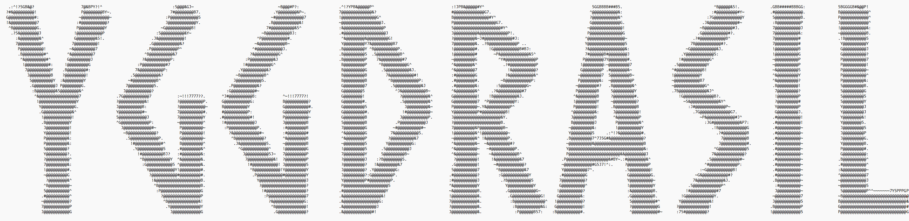

# Welcome to Yggdrasil!

This is an Apache Kafka and Zookeeper clone complete with:
- Multi producer-consumer support
- Replication of data across brokers
- Heartbeat based failure detection system that can auto-switch over.
- Auto discovery of services using Odin as the communication rendezvous point.
  
Primarily built with Flask and Sockets to handle flow of data and connections between services. A little bit of shell scripting for startup convenience.

We named the components after Nordic mythology - Heimdall being the Zookeeper, Odin being the broker, Peasants being the consumers and being the Producers.
Done as part of the Big Data course at university.

